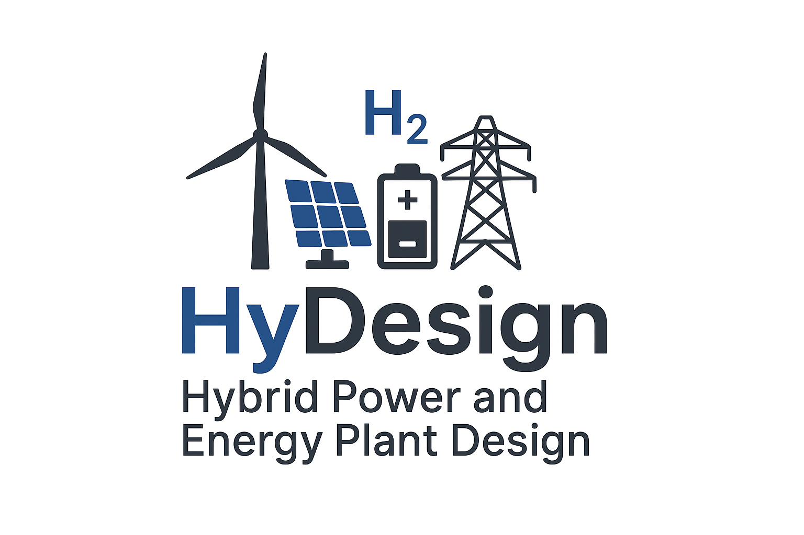

Welcome to hydesign
===========================================

HyDesign is the DTU tool for design, control and optimization of utility scale Hybrid Power- and Energy Plants including  wind, solar, storage and P2X technologies.

For installation instructions, please see the :ref:`Installation Guide <installation>`.

Source code repository and issue tracker:
    https://gitlab.windenergy.dtu.dk/TOPFARM/hydesign
    
License:
    MIT_

.. _MIT: https://gitlab.windenergy.dtu.dk/TOPFARM/hydesign/blob/main/LICENSE

Getting Started
^^^^^^^^^^^^^^^^^^^^^^^^^^^^^^^^^^^^^^^^^^^^^^^^^^
The :ref:`Quickstart </notebooks/Quickstart.ipynb>` section shows how to set up and perform some basic operations in hydesign.

For an in-depth explanation of how to work with HyDesign, please see :download:`Working with HyDesign <HyDesign_Instructions.pdf>`.

Explanations of hydesign's core objects can be found in the following tutorials:

    .. toctree::
        :maxdepth: 1
	:caption: Contents
    
        installation
        how_to_cite
        notebooks/ChangeLog
               
    .. toctree::
        :maxdepth: 1
	:caption: Evaluation Tutorials

	notebooks/Quickstart
	notebooks/Advanced_hpp_model
	notebooks/HPP_evaluation_P2X
	notebooks/PyWake_P2X_Example
	notebooks/break_even_price_and_PPA
	notebooks/constant_output
	notebooks/offshore
	notebooks/Example_ISO_prob
	notebooks/HPP_evaluation_BM
	notebooks/Hybridize
	notebooks/evaluate_with_reliability
	notebooks/HPP_evaluation_P2MeOH

    .. toctree::
        :maxdepth: 1
	:caption: Sizing Tutorials

	notebooks/Simple_Sizing_Example
	notebooks/Simple_Sizing_P2X_Example
	notebooks/sizing_with_reliability
       

    .. toctree::
        :maxdepth: 1
	:caption: HiFi EMS

	notebooks/HiFiEMS

    .. toctree::
        :glob:
        :maxdepth: 1
	:caption: Publications
    
        pub_tool
        pub_theses
        pub_related
    

    .. toctree::
        :maxdepth: 1
	:caption: API reference

    
